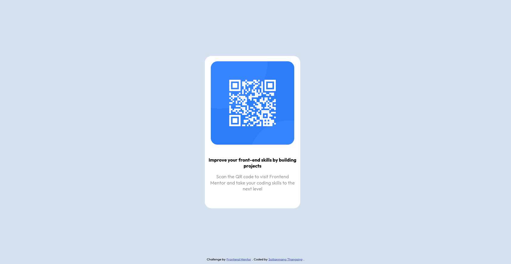

# Frontend Mentor - QR code component solution

This is a solution to the [QR code component challenge on Frontend Mentor](https://www.frontendmentor.io/challenges/qr-code-component-iux_sIO_H). Frontend Mentor challenges help you improve your coding skills by building realistic projects. 

## Table of contents

- [Overview](#overview)
  - [Screenshot](#screenshot)
  - [Links](#links)
- [My process](#my-process)
  - [Built with](#built-with)
  - [What I learned](#what-i-learned)
- [Author](#author)
- [Acknowledgments](#acknowledgments)

## Overview

### Screenshot

### Links

- Solution URL: [Add solution URL here](https://github.com/soithangsing/qr-component-challenge)
- Live Site URL: [Add live site URL here](https://soithangsing.github.io/qr-component-challenge/)

## My process

### Built with

- Semantic HTML5 markup
- Flexbox

### What I learned

In my first front-end mentors challenge I created this QR card component with CSS flex. I learned that div containers help in micro-styling spaces in HTML elements. 

## Author

- Website - [Soi Thangsing](https://soithangsing.github.io/portfolio-website-v1/)
- Frontend Mentor - [@yourusername](https://www.frontendmentor.io/profile/soithangsing)
- Twitter - [@yourusername](https://twitter.com/theofficialsoi)

## Acknowledgments

Thanks to The Odin Project, really helped me to learn about flex. 
